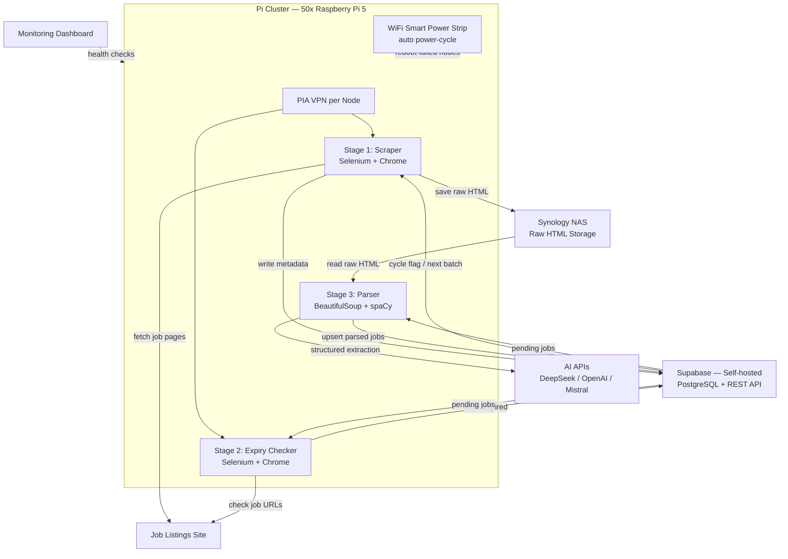

# LinkedIn Job Scraper

A three-stage pipeline that scrapes LinkedIn job listings, checks their expiry, and parses structured data using NLP and AI APIs — storing everything in Supabase.

> **Disclaimer:** This tool is intended for personal and research use. Scraping LinkedIn may violate their [Terms of Service](https://www.linkedin.com/legal/user-agreement). Use responsibly and at your own risk.

---

## System Architecture



---

## Pipeline Overview

```
linkedin_jobs_scrape.py  →  linkedin_job_expiry.py  →  job_parser.py
      (Scrape)                    (Expiry Check)            (Parse)
```

### 1. `linkedin_jobs_scrape.py` — Job Scraper
Reads companies from Supabase, visits their LinkedIn job pages, and saves raw job HTML and metadata.

- Iterates over companies using a cycle-based system (flip-flop boolean to track progress)
- Filters by country (India / US), band, domain, and funding
- Handles LinkedIn modals, 429 rate-limit errors, and "See more jobs" pagination
- Stores raw HTML to Supabase Storage (Synology) and job metadata to `scraping_raw_html` table

### 2. `linkedin_job_expiry.py` — Expiry Checker
Visits each scraped LinkedIn job URL to check if the listing is still active.

- Detects expired jobs via `expired_jd_redirect` in URL or "Page not found" in page source
- Extracts apply link, job posted date, and cleans LinkedIn tracking parameters from URLs
- Marks expired jobs in the `jobs` table with a fixed date (`1970-01-01`)
- Logs each check to the `transaction_log` table

### 3. `job_parser.py` — Job Parser
Parses raw HTML from scraped jobs to extract structured information using NLP and AI.

- Uses **BeautifulSoup** for HTML parsing and **spaCy** for NLP (skills, experience extraction)
- Calls **DeepSeek**, **OpenAI**, and **Mistral** APIs for AI-assisted parsing
- Assigns job roles, skill sets, experience levels, and company group memberships
- Upserts parsed data to the `jobs` table in Supabase

---

## Setup

### Prerequisites
- Python 3.9+
- Google Chrome installed
- `chromedriver` (auto-managed on laptop; must be at `/usr/bin/chromedriver` on Raspberry Pi)

### Install dependencies

```bash
python -m venv venv
source venv/bin/activate
pip install -r requirements.txt
```

### Configure environment

Create a `.env` file in the project root (never commit this):

```
SUPABASE_URL=http://<your-supabase-host>
SUPABASE_KEY=<your-service-role-key>
DEEPSEEK_API_KEY=<your-deepseek-key>
OPENAI_API_KEY=<your-openai-key>
MISTRAL_API_KEY=<your-mistral-key>
```

---

## Configuration

Each script has constants at the top to configure behaviour:

### Platform Switch
```python
IS_RASPBERRY_PI = False  # True = Raspberry Pi (fixed chromedriver path, optional headless)
                         # False = Linux laptop (ChromeDriverManager, visible browser)
```

### Country / Region (`linkedin_jobs_scrape.py`, `linkedin_job_expiry.py`)
```python
is_india = True   # Scrape/check India jobs
is_us = False     # Scrape/check US jobs
```

### Ordering (`linkedin_job_expiry.py`)
```python
is_random_job = False  # Random order
has_order = True       # Ordered by job_posted_on desc
```

---

## Running

Run each script independently:

```bash
# Stage 1: Scrape jobs
python linkedin_jobs_scrape.py

# Stage 2: Check expiry
python linkedin_job_expiry.py

# Stage 3: Parse job data
python job_parser.py
```

---

## Project Structure

```
.
├── linkedin_jobs_scrape.py   # Stage 1: Scrape LinkedIn job listings
├── linkedin_job_expiry.py    # Stage 2: Check if jobs are still active
├── job_parser.py             # Stage 3: Parse and structure job data with AI
├── requirements.txt          # Python dependencies
├── .env                      # Secrets (gitignored)
├── .gitignore
└── cycle_logs.txt            # Runtime log file (gitignored)
```

---

## Dependencies

| Package | Purpose |
|---|---|
| `selenium` | Browser automation |
| `webdriver-manager` | Auto-manage ChromeDriver on laptop |
| `supabase` | Supabase client |
| `python-dotenv` | Load `.env` secrets |
| `requests` | HTTP requests for expiry check |
| `beautifulsoup4` | HTML parsing in job parser |
| `spacy` | NLP for skill/experience extraction |
| `openai` | OpenAI + DeepSeek API client |
| `mistralai` | Mistral API client |
| `chevron` | Mustache template rendering |
